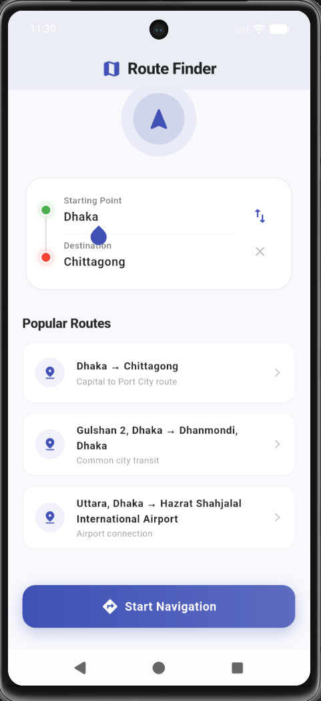
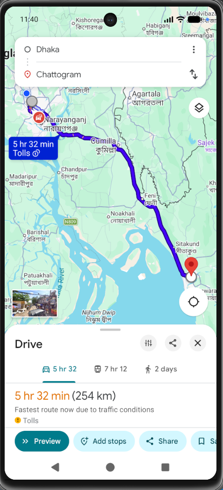

# Navigate with Google Maps App 🗺️

[](https://github.com/avijitbarua/navigate_with_google_map_app/actions/workflows/flutter.yml)
[](https://opensource.org/licenses/MIT)

একটি কাস্টম ফ্লাটার অ্যাপ থেকে গুগল ম্যাপস (Google Maps) ওপেন করে ড্রাইভিং ডিরেকশন বা নেভিগেশন দেখানোর একটি বেসিক ডেমো প্রজেক্ট। 

This is a basic Flutter application demonstrating how to open the Google Maps app with pre-defined/user-defined driving directions using Android Intent.

---

## 📸 Demo Preview (ডেমো প্রিভিউ)

| 📱 Custom App UI | 🗺️ Google Maps Navigation |
| :---: | :---: |
|  |  |

---

## 🌟 Features (বৈশিষ্ট্যসমূহ)
* 📍 **Source & Destination Inputs:** ব্যবহারকারী খুব সহজেই "From" এবং "To" ইনপুট দিতে পারেন।
* 🚗 **Direct Navigation:** গুগল ম্যাপসে সরাসরি ড্রাইভিং মোডে রুট বা ডিরেকশন চালু হয়।
* 🔗 **Android Intent Integration:** `android_intent_plus` প্যাকেজ ব্যবহারের মাধ্যমে অ্যান্ড্রয়েড সিস্টেমের ইন্টেন্ট ব্যবহার করে সরাসরি গুগল ম্যাপস অ্যাপটি ওপেন করা হয়।
* ⚡ **Android 11+ Compatibility:** অ্যান্ড্রয়েড ১১ বা তার পরবর্তী সংস্করণের জন্য প্রয়োজনীয় প্যাকেজ ভিজিবিলিটি কুয়েরি কনফিগারেশন করা আছে।

---

## 🛠️ Tech Stack & Packages
* **Flutter SDK:** `>=3.12.2`
* **Dependency:** [`android_intent_plus: ^6.0.0`](https://pub.dev/packages/android_intent_plus)

---

## ⚙️ Android Configuration (কনফিগারেশন)

অ্যান্ড্রয়েড ১১ (API 30) এবং তার পরবর্তী সংস্করণগুলোতে সিকিউরিটি পলিসির জন্য অন্য অ্যাপ ওপেন করতে হলে `AndroidManifest.xml` ফাইলে কুয়েরি ডিক্লেয়ার করতে হয়।

এই প্রজেক্টের `android/app/src/main/AndroidManifest.xml` ফাইলে `<queries>` ট্যাগের ভেতরে নিচের কনফিগারেশনটি যুক্ত করা আছে:

```xml
<queries>
    <!-- ১. গুগল ম্যাপস অ্যাপ কুয়েরি করার জন্য -->
    <package android:name="com.google.android.apps.maps" />
    
    <!-- ২. গুগল ম্যাপস ইউআরএল স্কিম কুয়েরি করার জন্য -->
    <intent>
        <action android:name="android.intent.action.VIEW" />
        <data android:scheme="https" android:host="google.com" />
    </intent>
</queries>
```

---

## 🚀 Key Implementation (মূল কোড)

গুগল ম্যাপস ড্রাইভিং ডিরেকশন ওপেন করার মূল ফাংশনটি নিচে দেওয়া হলো:

```dart
Future<void> _launchMapsIntent() async {
  final from = _fromController.text.trim();
  final to = _toController.text.trim();
  if (from.isEmpty || to.isEmpty) return;

  if (Platform.isAndroid) {
    // গুগল ম্যাপস ডিরেকশন ইউআরএল ফরম্যাট
    final mapsUrl =
        'https://www.google.com/maps/dir/?api=1&origin=${Uri.encodeComponent(from)}&destination=${Uri.encodeComponent(to)}&travelmode=driving';

    final intent = AndroidIntent(
      action: 'action_view',
      data: mapsUrl,
      package: 'com.google.android.apps.maps',
    );
    
    // গুগল ম্যাপস অ্যাপটি ডিভাইসে আছে কিনা তা চেক করে ওপেন করা
    if (await intent.canResolveActivity() ?? false) {
      await intent.launch();
    } else {
      // গুগল ম্যাপস অ্যাপ না থাকলে ব্রাউজারে ওপেন করার লজিক এখানে যুক্ত করতে পারেন
    }
  }
}
```

---

## 🏃 How to Run (রান করার নিয়ম)

১. প্রজেক্টটি ক্লোন বা ডাউনলোড করুন।
২. আপনার টার্মিনালে নিচের কমান্ডটি রান করে ডিপেন্ডেন্সিগুলো ডাউনলোড করুন:
   ```bash
   flutter pub get
   ```
৩. প্রজেক্টটি রান করতে:
   ```bash
   flutter run
   ```

---
